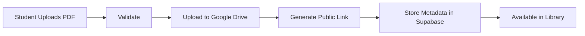

<div align="center">


[](https://git.io/typing-svg)

<p>


</p>

</div>

---

# 📚 About

> A centralized academic repository developed for **NSS Model Engineering College**.

Aksharasethu enables students to upload, discover, organize, preview and download academic resources including notes, textbooks, previous-year question papers, lab manuals and more.

---

## ✨ Features

<table>
<tr>
<td width="50%">

### 📖 Library

- Advanced Search
- Categories
- Tags
- PDF Preview
- Downloads
- Bookmarks
- Collections

</td>

<td width="50%">

### 🚀 Platform

- Google Authentication
- Google Drive Storage
- Supabase Database
- Admin Dashboard
- Analytics
- Responsive UI

</td>
</tr>
</table>

---

# 🛠 Tech Stack

<p align="center">


</p>

---

# 🏗 Architecture

```text
              Users
                 │
                 ▼
      Next.js 16 Application
                 │
     ┌───────────┴────────────┐
     ▼                        ▼
Supabase Auth         API Route Handlers
     │                        │
     ▼                        ▼
 PostgreSQL          Google Drive API
     │                        │
     └──────────────┬─────────┘
                    ▼
              Academic PDFs
```

---

# 📂 Project Structure

```text
src
├── app
├── actions
├── components
├── hooks
├── lib
│   ├── drive
│   ├── supabase
│   └── validations
├── services
├── types
└── utils
```

---

# 📈 Workflow



---

# 🚀 Getting Started

```bash
git clone https://github.com/USERNAME/aksharasethu.git

cd aksharasethu

pnpm install

pnpm dev
```

---

<div align="center">

### ⭐ If you find this project useful, consider starring the repository.


</div>